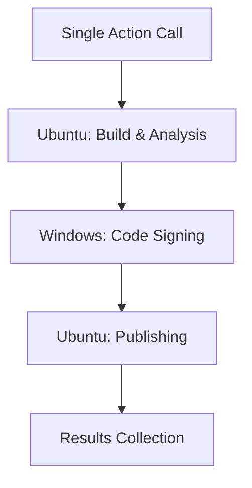

# Fast AL Builder

[](https://github.com/attieretief/Fast-AL-Builder)
[](https://opensource.org/licenses/MIT)
[](https://docs.microsoft.com/en-us/dynamics365/business-central/dev-itpro/developer/devenv-programming-in-al)

A comprehensive, production-ready GitHub Action for building, signing, and publishing Microsoft Dynamics 365 Business Central AL extensions with multi-runner optimization and intelligent symbol management.

## Features

### 🎯 **Single-Step Simplicity**
- **One action call** handles the entire AL extension pipeline
- **Automatic runner management** - Ubuntu for speed, Windows when required
- **Zero configuration** for standard AL projects

### 🏗️ **Complete AL Pipeline**
- 🚀 **Fast AL compilation** with automated symbol management
- 🔍 **Smart dependency resolution** from AppSource, Microsoft, and LINC registries
- 🏗️ **Intelligent version generation** based on git events and branches
- ✍️ **Azure Key Vault code signing** integration for Windows
- 🏪 **AppSource publishing** with automatic product detection
- 🧪 **PR check mode** for fast compilation validation
- 📦 **Multi-version support** for different BC versions
- 🔧 **Configurable build targeting** (OnPrem/Cloud)

### ⚡ **Performance Optimized**
- **Multi-runner architecture** - Ubuntu for building, Windows only for signing
- **Parallel processing** - Optimized for GitHub Actions cost and speed
- **Smart caching** - Symbol and dependency management
- **Lean execution** - Minimal resource usage

### 🔒 **Enterprise Ready**
- **Cross-platform compatibility** with proper platform detection
- **Production workflows** with comprehensive error handling
- **Local testing support** with mock SignTool for development
- **Comprehensive logging** and debugging capabilities

## Quick Start

### Basic Usage

```yaml
name: Build AL Extension

on:
  push:
    branches: [ main ]
  pull_request:
    branches: [ main ]

jobs:
  build:
    runs-on: ubuntu-latest
    steps:
      - uses: actions/checkout@v4
      
      - name: Build AL Extension
        uses: attieretief/Fast-AL-Builder@v1
        with:
          mode: ${{ github.event_name == 'pull_request' && 'check' || 'build' }}
```

### Advanced Usage with Code Signing and AppSource

```yaml
name: Full AL Build Pipeline

on:
  push:
    branches: [ main, develop ]
  pull_request:
    branches: [ main ]

jobs:
  build:
    runs-on: ubuntu-latest
    steps:
      - uses: actions/checkout@v4
      
      - name: Build and Sign AL Extension
        uses: attieretief/Fast-AL-Builder@v1
        with:
          mode: 'build'
          build-type: 'auto'
          linc-nuget-registry: ${{ vars.LINC_NUGET_REGISTRY }}
          linc-nuget-token: ${{ secrets.LINC_NUGET_TOKEN }}
          code-signing-vault-uri: ${{ secrets.AZURE_KEY_VAULT_URI }}
          code-signing-cert-name: ${{ secrets.AZURE_KEY_VAULT_CERT_NAME }}
          code-signing-app-id: ${{ secrets.AZURE_KEY_VAULT_APP_ID }}
          code-signing-app-secret: ${{ secrets.AZURE_KEY_VAULT_APP_SECRET }}
          code-signing-tenant-id: ${{ secrets.AZURE_KEY_VAULT_TENANT_ID }}
          appsource-tenant-id: ${{ secrets.APPSOURCE_TENANT_ID }}
          appsource-client-id: ${{ secrets.APPSOURCE_CLIENT_ID }}
          appsource-client-secret: ${{ secrets.APPSOURCE_CLIENT_SECRET }}
```

## Input Parameters

| Parameter | Description | Required | Default |
|-----------|-------------|----------|---------|
| `mode` | Build mode: `check` for PR validation, `build` for full build | Yes | `check` |
| `build-type` | Target BC version: `bc17`, `bc18`, `bc19`, `bc22`, `bccloud`, or `auto` | No | `auto` |
| `working-directory` | Directory containing the AL project | No | `.` |
| `nuget-feed-url` | Custom NuGet feed URL for AL compiler | No | `https://api.nuget.org/v3/index.json` |
| `linc-nuget-registry` | Linc GitHub NuGet registry URL | No | |
| `linc-nuget-token` | Token for Linc NuGet registry access | No | |
| `code-signing-vault-uri` | Azure Key Vault URI for code signing | No | |
| `code-signing-cert-name` | Certificate name in Azure Key Vault | No | |
| `code-signing-app-id` | Azure application ID for Key Vault | No | |
| `code-signing-app-secret` | Azure application secret for Key Vault | No | |
| `code-signing-tenant-id` | Azure tenant ID for Key Vault | No | |
| `appsource-tenant-id` | Azure tenant ID for AppSource publishing | No | |
| `appsource-client-id` | Client ID for AppSource API | No | |
| `appsource-client-secret` | Client secret for AppSource API | No | |
| `force-showmycode-false` | Force showMyCode to false for customer repos | No | `true` |

## Output Parameters

| Parameter | Description |
|-----------|-------------|
| `build-number` | Generated build number for the compiled app |
| `app-file-path` | Path to the compiled .app file |
| `compilation-success` | Whether compilation was successful |

## Build Modes

### Check Mode (`mode: check`)

Used for pull request validation:
- Downloads symbols and dependencies
- Performs test compilation with version 0.0.0.0
- Validates code quality and dependencies
- No artifacts are created or published
- Fast execution for quick feedback

### Build Mode (`mode: build`)

Used for production builds:
- Downloads symbols and dependencies
- Generates production version numbers
- Compiles with proper versioning
- Code signs the resulting .app file (if configured)
- Uploads build artifacts
- Publishes to AppSource (if configured and app qualifies)

## Version Generation

The action automatically generates version numbers based on the build context:

- **Production builds** (main/master branch): `{platform_major}.{year}.{days_since_2020}.{minutes_in_day}`
- **Development builds** (develop branch): `99.{year}.{days_since_2020}.{minutes_in_day}`
- **Test compilations** (PRs, other branches): `0.0.0.0`

## Symbol Management

The action intelligently manages AL symbols:

1. **Microsoft Symbols**: Downloaded from official NuGet packages based on the `application` version in app.json
2. **Dependency Symbols**: Resolved from configured NuGet registries
3. **Linc Dependencies**: Special handling for Linc extensions from GitHub NuGet registry

## AppSource Publishing

Automatic AppSource publishing is triggered when:
- Build mode is `build`
- Compilation was successful
- App has AppSource ID ranges (100000+)
- AppSource credentials are provided

The action will:
1. Authenticate with Microsoft Partner Center API
2. Find the existing product by name
3. Create a new submission with the compiled app
4. Include library dependencies if detected
5. Auto-promote the submission

## Code Signing

Code signing using Azure Key Vault is supported:
- Uses Azure Sign Tool for cross-platform signing
- Supports certificate management through Azure Key Vault
- Includes timestamp server for long-term validity
- Optional signature verification

## Multi-Version Support

The action supports building for multiple BC versions:

1. Create version-specific app.json files (e.g., `bc22_app.json`, `cloud_app.json`)
2. Specify the target version using `build-type` parameter
3. The action will automatically switch to the appropriate app.json file

## Examples

See the [`examples/`](./examples/) directory for complete workflow examples:

- [`simple-workflow.yml`](./examples/simple-workflow.yml) - Basic build setup
- [`build-workflow.yml`](./examples/build-workflow.yml) - Advanced pipeline with signing
- [`multi-version-workflow.yml`](./examples/multi-version-workflow.yml) - Multi-version matrix build

## 📚 Documentation

- **[Multi-Runner Architecture](MULTI_RUNNER_ARCHITECTURE.md)** - Technical deep dive into the multi-runner system
- **[Code Signing Analysis](CODE_SIGNING_ANALYSIS.md)** - Platform requirements and Windows signing explained  
- **[User Guide](README_MULTI_RUNNER.md)** - Complete usage documentation with examples
- **[Alternative Testing](ALTERNATIVE_TESTING_APPROACHES.md)** - Docker and VM testing approaches

## 🧪 Local Development & Testing

### Cross-Platform Testing
```bash
# Test code signing logic on macOS/Linux using mock SignTool
python scripts/code_sign.py app.app --test-mode \
  --cert-base64 "$(cat test-cert.txt)" \
  --cert-password "password"

# Run comprehensive signing tests
./test-windows-signing.sh

# Validate multi-runner architecture
./test-multi-runner.sh
```

### Mock SignTool for Development
The action includes a cross-platform mock SignTool for local testing:
```bash
python scripts/mock_signtool.py sign /f cert.pfx /p password file.app
```

## 🏛️ Multi-Runner Architecture

This action uses a sophisticated multi-runner system for optimal performance:



**Why Multi-Runner?**
- AL extensions require Windows SignTool (proprietary NAVX format)
- Ubuntu runners are faster and more cost-effective for building
- Automatic coordination handles complexity for users

## Repository Structure

The AL repository should have this structure:

```
your-al-repo/
├── app.json                 # Main app configuration
├── bc22_app.json           # Optional: BC 22 specific config
├── cloud_app.json          # Optional: Cloud specific config
├── LincRuleSet.json        # Optional: Custom ruleset
├── src/                    # AL source files
│   ├── *.al
│   └── ...
└── .github/
    └── workflows/
        └── build.yml       # Your workflow file
```

## Requirements

- Ubuntu runner (recommended) or Windows runner
- .NET SDK (automatically installed)
- AL project with valid app.json
- Appropriate secrets configured for signing/publishing

## Troubleshooting

### Common Issues

1. **AL Compiler not found**: Ensure the action can install .NET tools globally
2. **Symbol download failures**: Check network connectivity and NuGet feed accessibility
3. **Code signing failures**: Verify Azure Key Vault permissions and credentials
4. **AppSource publishing failures**: Confirm product exists and API credentials are valid

### Debug Mode

Enable debug logging by adding this to your workflow:

```yaml
env:
  ACTIONS_STEP_DEBUG: true
  ACTIONS_RUNNER_DEBUG: true
```

## 🤝 Contributing

Contributions are welcome! Please read our [Contributing Guidelines](./CONTRIBUTING.md) and submit pull requests for any improvements.

### Development Setup
1. Clone the repository
2. Install dependencies: `pip install -r scripts/requirements.txt`
3. Run tests: `./test-windows-signing.sh`
4. Test locally with `--test-mode` for cross-platform development

## 📄 License

This project is licensed under the MIT License - see the [LICENSE](./LICENSE) file for details.

## 🙏 Acknowledgments

- Microsoft AL development team for the AL compiler and tools
- GitHub Actions team for the robust CI/CD platform  
- The Business Central community for continuous feedback and improvements

## 🔗 Links & Support

- **[GitHub Marketplace](https://github.com/marketplace/actions/fast-al-builder)** - Published action (coming soon)
- **[Documentation](https://github.com/attieretief/Fast-AL-Builder/wiki)** - Comprehensive guides
- **[Issues](https://github.com/attieretief/Fast-AL-Builder/issues)** - Bug reports and feature requests
- **[Discussions](https://github.com/attieretief/Fast-AL-Builder/discussions)** - Community support
- **[Examples](./examples/)** - Real-world workflow examples

For issues and questions:
- 🐛 **Bug Reports**: Create an issue with detailed steps to reproduce
- 💡 **Feature Requests**: Use GitHub issues with enhancement label
- ❓ **Questions**: Check discussions or create a new discussion thread
- 📖 **Documentation**: Review the comprehensive guides in this repository

---

**Made with ❤️ for the Business Central community**